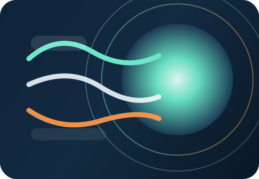
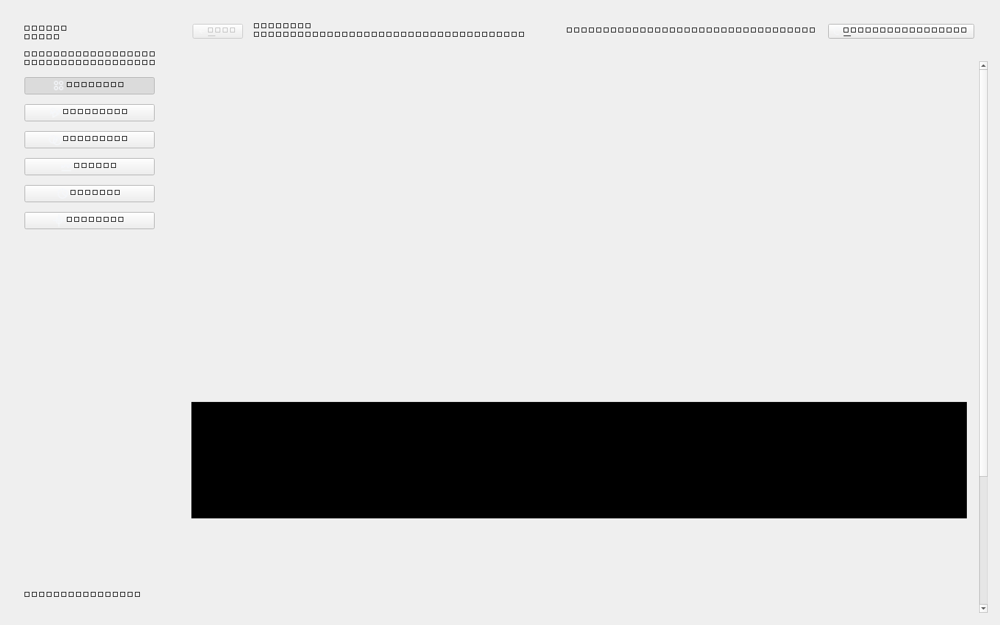
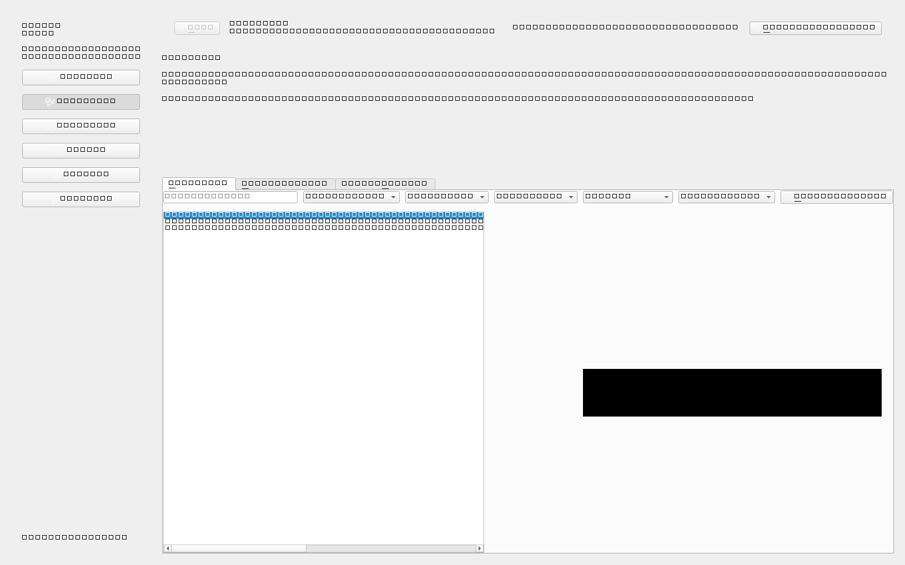
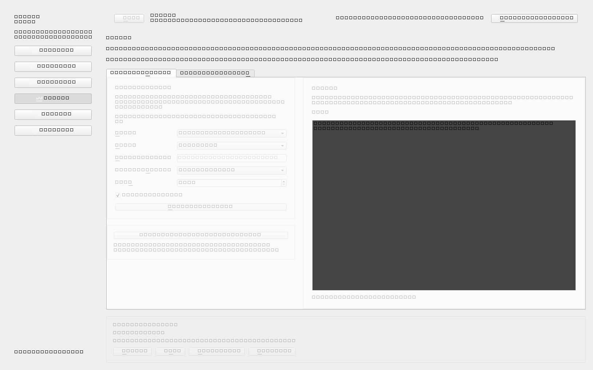
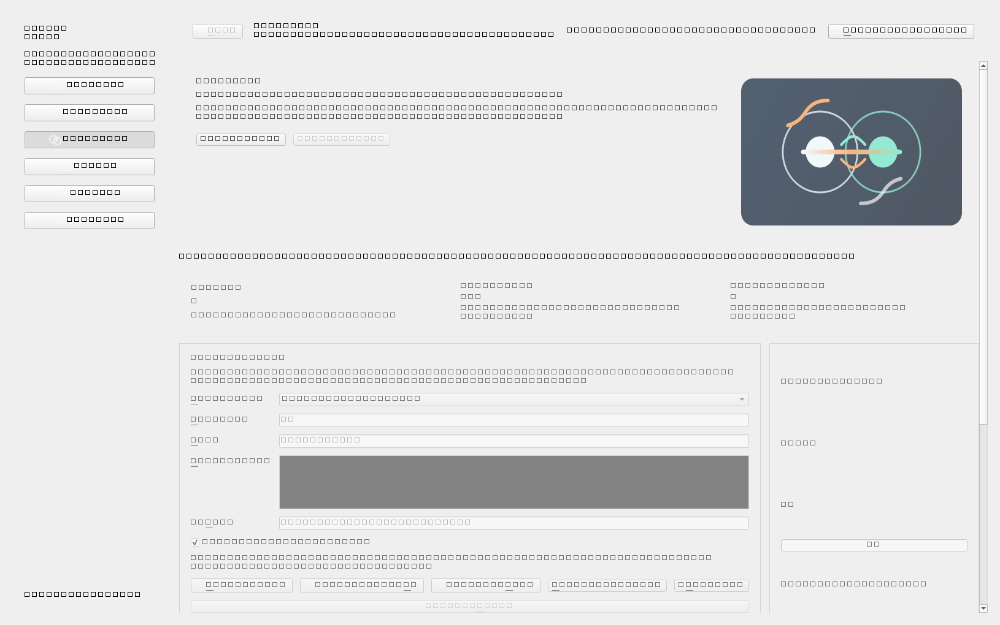

# Eleven GUI



## Overview

Eleven GUI is a desktop client for ElevenLabs built with Python 3.11+ and PySide6. It brings subscription visibility, voice management, cloning workflows, text-to-speech, speech-to-speech, playback, history management, and accessibility-focused navigation into one application.

The interface is designed for both keyboard-first and screen-reader users. The current UI direction favors a calmer layout, reduced visual density, and clear action grouping over engineering-panel complexity.

## Downloads

- [Latest Release](https://github.com/BarryAllen53/eleven-gui/releases/latest)
- Windows release artifacts are published as packaged executables built with Nuitka

## Screenshots

### Overview



### Voice Hub



### Studio



### Clone Lab



## Core Capabilities

### Workspace Control

- Subscription, credit usage, voice slot usage, and cloning access visibility
- Model availability overview for TTS and STS workflows
- Shared library browsing and import

### Voice Operations

- My Voices and Cloned Voices management
- Metadata editing
- Preview playback
- Batch selection and batch delete
- Route any supported voice directly into Studio

### Generation Workflows

- Text-to-Speech generation with voice settings overrides
- Speech-to-Speech conversion with source file selection
- Auto-play after generation
- Replay, regenerate, stop, and download actions

### Clone Workflows

- Instant Voice Clone and Professional Voice Clone flows
- Sample upload, sample reordering, and sample preview
- PVC verification and training actions
- Batch clone delete

### History

- Accessible history list
- Replay, batch download, and batch delete

## Accessibility

### Keyboard Navigation

- Global page shortcuts with `Ctrl+1` through `Ctrl+6`
- Context shortcuts for refresh, preview, use, delete, generate, download, and clone actions
- `F6` and `Shift+F6` region navigation
- Inner tab switching with `Ctrl+Tab`, `Ctrl+Shift+Tab`, `Ctrl+PgDown`, and `Ctrl+PgUp`

### Screen Reader Support

- Accessible names and descriptions across major controls
- List-based selection flows instead of screen-reader-hostile data grids for key pages
- Focus-safe text editors where `Tab` moves to the next control
- Consolidated announcements for removed unavailable voices
- Optional `accessible_output2` spoken fallback on Windows

## Technology Stack

- Python 3.11+
- [PySide6](https://doc.qt.io/qtforpython-6/)
- [httpx](https://www.python-httpx.org/)
- [python-dotenv](https://pypi.org/project/python-dotenv/)
- [accessible-output2](https://pypi.org/project/accessible-output2/) on Windows

## Installation

```powershell
python -m pip install -r requirements.txt
python main.py
```

## Build a Windows Executable

The project includes a release build script for Nuitka:

```powershell
powershell -ExecutionPolicy Bypass -File .\scripts\build-release.ps1 -Version 1.0.0
```

Build outputs:

- `build/` for intermediate compilation output
- `dist/release/ElevenGUI-<version>-win64/ElevenGUI.exe`
- `dist/release/ElevenGUI-<version>-win64.zip`

## Configuration

The app reads the ElevenLabs API key from one of the following locations:

1. `.env`
2. `api key.txt`

Preferred `.env` format:

```env
ELEVENLABS_API_KEY=your_key_here
```

Secrets are intentionally excluded from version control through `.gitignore`.

For release builds, place `.env` next to the executable if you want the packaged app to load the API key automatically.

## Project Structure

```text
eleven_gui/
├─ api/            # ElevenLabs client and payload models
├─ assets/         # SVG illustrations and app icon
├─ services/       # Worker infrastructure
├─ ui/
│  ├─ pages/       # Application pages
│  └─ widgets.py   # Shared UI building blocks
├─ accessibility.py
├─ config.py
├─ theme.py
└─ app.py
```

## Running the App

```powershell
python main.py
```

Generated audio files are written to `outputs/`. Temporary working files are written to `.cache/`.

## Development Notes

### UI Direction

- Reduced information density
- Summary-first layouts
- Collapsible advanced controls in Studio
- Batch-friendly list interactions
- Strong focus visibility for low-vision and keyboard users

### Git Hygiene

- `.env` and `api key.txt` are ignored
- `outputs/` and `.cache/` are ignored

## Release Files

- [CHANGELOG.md](CHANGELOG.md)
- [Release Notes](docs/release-notes/v1.0.0.md)
- [LICENSE](LICENSE)
- [.env.example](.env.example)
- [CONTRIBUTING.md](CONTRIBUTING.md)
- [SECURITY.md](SECURITY.md)

## API References

- [Introduction](https://elevenlabs.io/docs/api-reference/introduction)
- [Get User Subscription](https://elevenlabs.io/docs/api-reference/user/subscription/get)
- [List Voices](https://elevenlabs.io/docs/api-reference/voices/search)
- [Get Shared Voices](https://elevenlabs.io/docs/api-reference/voices/voice-library/get-shared)
- [Add Shared Voice](https://elevenlabs.io/docs/api-reference/voices/voice-library/share)
- [Create Instant Voice Clone](https://elevenlabs.io/docs/api-reference/voices/add)
- [Text to Speech](https://elevenlabs.io/docs/api-reference/text-to-speech/convert)
- [Speech to Speech](https://elevenlabs.io/docs/api-reference/speech-to-speech/convert)
- [History](https://elevenlabs.io/docs/api-reference/history/get-all)

## Status

The application currently covers the main ElevenLabs desktop workflows with a strong emphasis on accessibility, batch actions, and a more modern UI structure.
